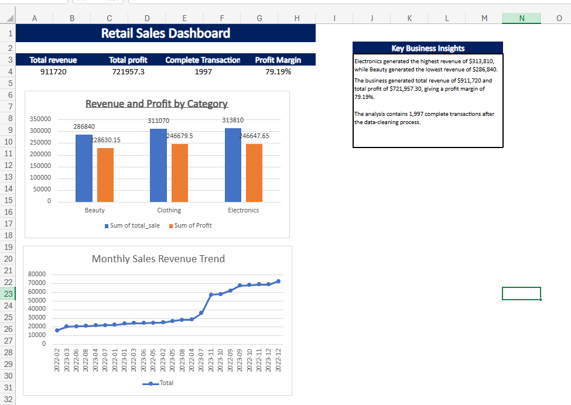

# Retail Sales Analysis in Excel

## Project Overview

This project analyzes 2,000 retail sales records from 2022 to 2023. I used Excel to clean the dataset, check its quality, calculate profit, summarize business performance and create an interactive transaction lookup tool.

## Project Objectives

- Clean and validate the retail sales data
- Identify incomplete or invalid records
- Calculate revenue, profit and profit margin
- Compare revenue and profit across product categories
- Analyze monthly sales performance
- Create a dashboard for presenting the results
- Build an XLOOKUP tool for finding individual transactions

## Tools and Skills Used

- Microsoft Excel
- Data cleaning and validation
- Excel tables
- PivotTables
- PivotCharts
- XLOOKUP
- Excel formulas
- Dashboard design
- Business insight reporting

## Data Cleaning Process

I checked the dataset for:

- Missing values
- Duplicate transaction IDs
- Invalid dates
- Inconsistent gender and category values
- Unreasonable ages, quantities and prices
- Incomplete transactions

I also created helper columns for Year-Month, transaction status and profit.

## Key Results

- Total Revenue: **$911,720**
- Total Profit: **$721,957.30**
- Profit Margin: **79.19%**
- Complete Transactions: **1,997**
- Electronics generated the highest revenue: **$313,810**
- Beauty generated the lowest revenue: **$286,840**
- Clothing generated the highest profit: **$246,679.50**
- February 2022 recorded the lowest monthly revenue: **$16,110**
- December 2022 recorded the highest monthly revenue: **$72,880**

## Dashboard Preview

## Workbook Contents

- **Raw Data** – original dataset
- **Cleaned Data** – validated data used for analysis
- **Data Quality** – checks performed and results recorded
- **PivotTables** – supporting calculations
- **Dashboard** – KPIs, charts and key insights
- **Analysis Summary** – written findings
- **Lookup Tool** – transaction search using XLOOKUP

## Project Files

- `Retail_Sales_Analysis_Excel_Project.xlsx`
- `Retail_Sales_Dashboard.png`

## Author

**Patience Okwori**  
Data Analyst
